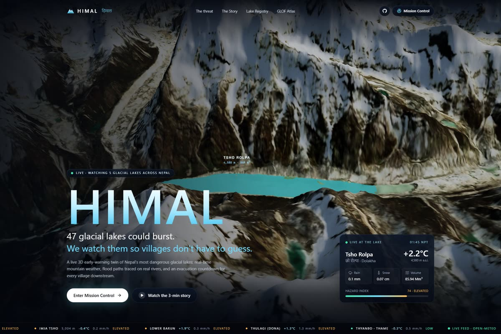
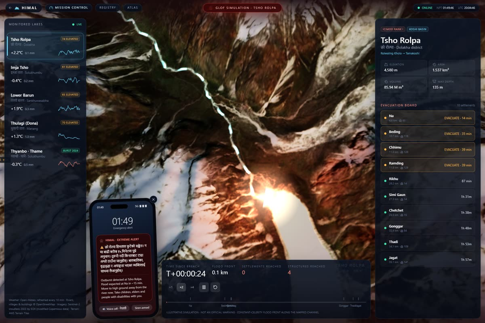
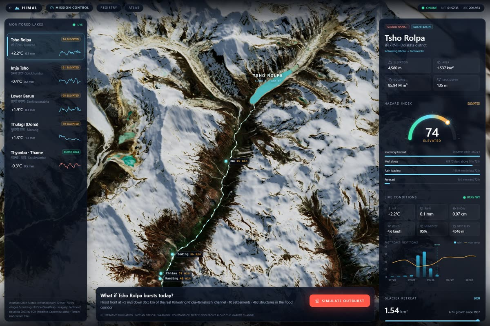
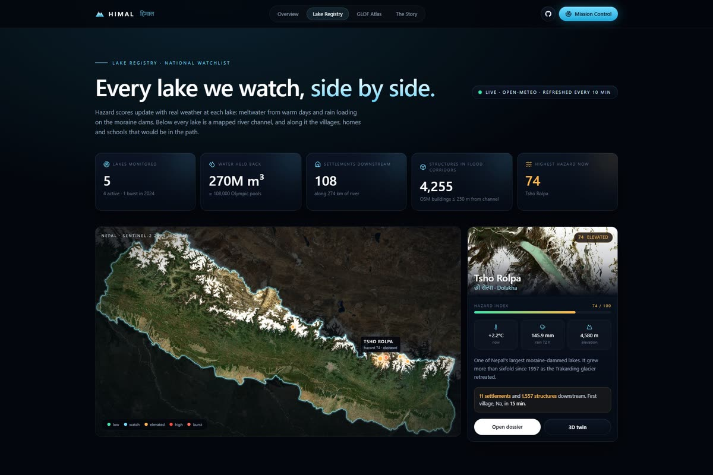
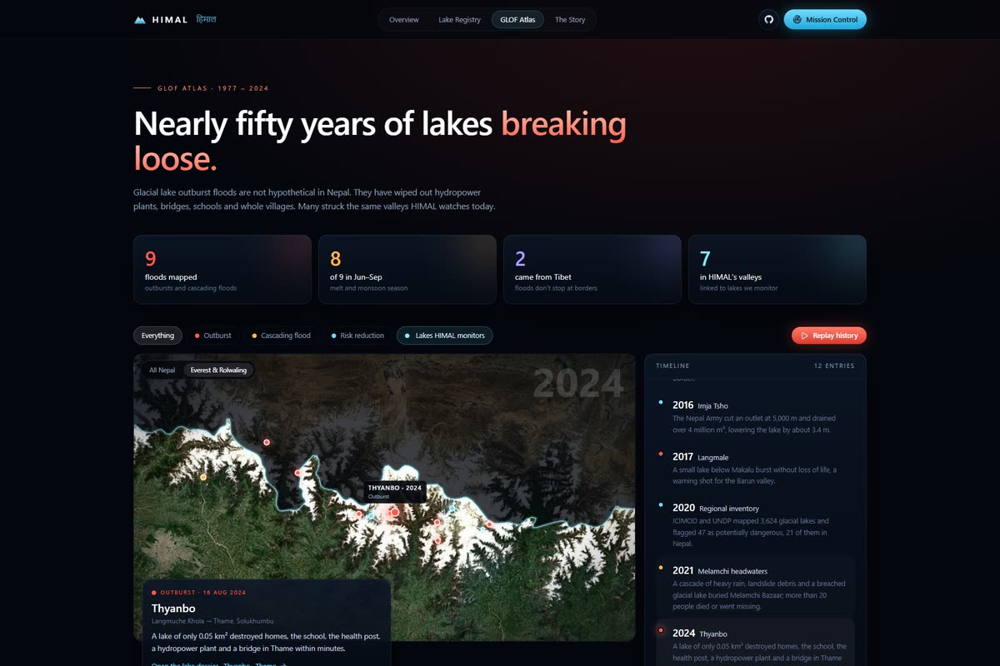
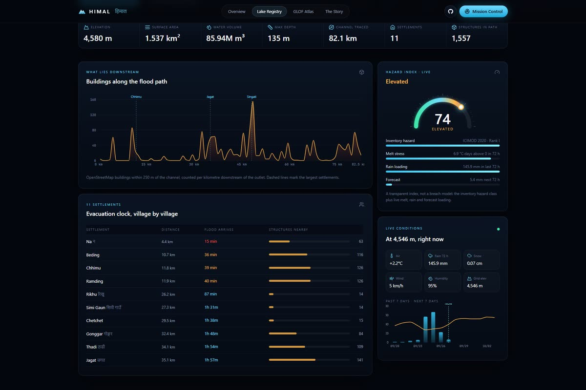
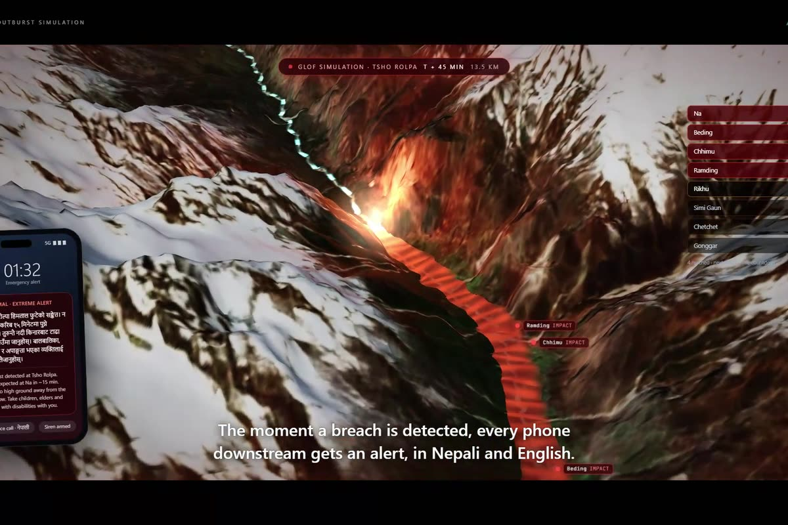

<div align="center">

# HIMAL · हिमाल

### Glacial lake early warning for Nepal

A live 3D satellite twin of Nepal's most dangerous glacial lakes. It tracks real-time melt and rain,
simulates outburst floods down the real river channels, and counts down the minutes each village has to evacuate.

**[Live site](https://himal-nepal.vercel.app)** · **[Watch the 3-minute story](https://himal-nepal.vercel.app/story)** · Built for the Acodemic × G.I.R.L.S. Global SDG Hackathon



</div>

## Why

On 16 August 2024 a small glacial lake called Thyanbo, about 0.05 km², burst above the village of Thame in Nepal's Everest region. Within minutes it destroyed 25 homes and guesthouses, the school, the health post, a hydropower plant and a bridge.

ICIMOD and UNDP have mapped 3,624 glacial lakes in Nepal's Koshi, Gandaki and Karnali basins and flagged 47 as potentially dangerous, 21 of them inside Nepal. Many are still growing as the glaciers above them retreat.

HIMAL answers one question: if one of these lakes burst today, how many minutes would each village downstream have?

## What's inside

| | |
|---|---|
| **Mission Control** `/control` | A 3D model of the Nepal Himalaya from real elevation data and Sentinel-2 imagery. Roam the country, fly into five monitored lakes, and see each one's live hazard score and weather. |
| **Outburst simulation** | At Tsho Rolpa, a flood front travels down the real, traced river channel while a chase camera follows it. Each village counts down to impact, and a phone preview shows the bilingual (Nepali / English) SMS alert. |
| **Lake Registry** `/lakes` | Every lake side by side: a live satellite map, a hazard ranking, live temperature charts, lake growth, stored water vs. buildings in the path, and time to the first village. |
| **Lake pages** `/lakes/[id]` | Key figures, the live hazard breakdown, a chart of buildings along the flood path, and an evacuation clock for every settlement downstream. |
| **GLOF Atlas** `/atlas` | Nearly 50 years of outburst floods that hit Nepal, on an animated map with a *Replay history* mode. |
| **The Story** `/story` | A 3-minute cinematic walkthrough with scripted camera flights, live data and a soundtrack generated in the browser. |

<table>
<tr>
<td></td>
<td></td>
</tr>
<tr>
<td></td>
<td></td>
</tr>
<tr>
<td></td>
<td></td>
</tr>
</table>

## Monitored lakes

| Lake | District | River | Settlements downstream | Buildings in flood corridor |
|---|---|---|---|---|
| Tsho Rolpa | Dolakha | Rolwaling Khola → Tamakoshi | 11 | 1,557 |
| Imja Tsho | Solukhumbu | Imja Khola → Dudh Koshi | 35 | 812 |
| Lower Barun | Sankhuwasabha | Barun Khola → Arun | 11 | 304 |
| Thulagi (Dona) | Manang | Dona Khola → Marsyangdi | 23 | 866 |
| Thyanbo (burst 2024) | Solukhumbu | Langmuche Khola → Bhote Koshi | 28 | 716 |

*Buildings are OpenStreetMap structures within 250 m of the traced channel.*

## How the numbers work

**Hazard score (0–100).** It's deliberately simple and transparent, not a breach model:

- **Base:** from the lake's ICIMOD hazard class.
- **Melt stress (up to 15):** degree-hours above 0 °C over the last 72 hours.
- **Rain loading (up to 15):** rainfall over the last 72 hours.
- **Forecast (up to 8):** rain expected in the next 72 hours.

The weather comes from Open-Meteo, refreshed every 10 minutes. The code is in [`src/lib/weather.ts`](src/lib/weather.ts).

**Flood arrival.** The time for the flood to reach a village is its distance down the river channel divided by an assumed flood speed of 5 m/s. Real outbursts typically travel at about 3–10 m/s, which is why the simulation is labelled illustrative. For example, Na is 4.4 km below Tsho Rolpa, so it has about 15 minutes.

## How it's built

- **Frontend:** Next.js 15 (App Router), React 19, TypeScript, Tailwind CSS v4, Framer Motion, Recharts.
- **3D:** Three.js with React Three Fiber and drei, plus custom GLSL shaders for the flood, the river and the snow tone.
  - The scene renders only when needed, capped at 60 fps, and pauses when off-screen.
- **Terrain:** each valley is baked ahead of time into a 16-bit height grid and a 4K Sentinel-2 texture, all in one shared km-based projection, so it loads fast instead of streaming map tiles.
- **Rivers and villages:** traced from OpenStreetMap via the Overpass API, following waterway direction downstream from each lake outlet.
- **Sound:** the story's score (pads, piano, singing bowl, taiko, flood rumble, alert tones) is synthesized live with the Web Audio API. There are no audio files.
- **Hosting:** Vercel. No API keys are needed anywhere.

```
src/
  app/            routes: /, /control, /lakes, /lakes/[id], /atlas, /story
  components/     Valley3D (3D engine), MissionControl, LakesDashboard, LakeDossier, Atlas, Story, ...
  data/           lakes.ts, glofs.ts, geo/*.json (traced rivers, villages, building chainage)
  lib/            scene loading and projection, weather and hazard index, story soundtrack
public/scene/     baked terrain + imagery for Nepal and each lake valley
scripts/          Python data pipeline
```

## Run it locally

```bash
npm install
npm run dev        # http://localhost:3000
```

To produce a production build: `npm run build && npm start`.

### Rebuilding the data (optional)

The baked scenes and traced rivers are already in the repo. To regenerate them (Python 3, `numpy`, `pillow`):

```bash
# terrain + imagery for one valley: output dir, then west south east north
python scripts/bake_scene.py public/scene/tsho-rolpa 86.19 27.79 86.56 27.99

# downstream river paths from each lake outlet, then settlements and buildings along them
python scripts/trace_rivers.py tsho-rolpa
python scripts/find_villages.py tsho-rolpa
```

## Data sources

- ICIMOD & UNDP, *Inventory of glacial lakes and identification of potentially dangerous glacial lakes* (2020)
- ICIMOD, Thyanbo / Thame GLOF report (August 2024)
- [Open-Meteo](https://open-meteo.com/): live and forecast weather
- [OpenStreetMap](https://www.openstreetmap.org/) contributors: rivers, settlements and buildings (ODbL)
- [AWS Terrain Tiles](https://registry.opendata.aws/terrain-tiles/): elevation
- [Sentinel-2 cloudless 2023 by EOX IT Services GmbH](https://s2maps.eu) (contains modified Copernicus Sentinel data 2023), CC BY-NC-SA 4.0
- [Natural Earth](https://www.naturalearthdata.com/): national border

## SDGs

**13** Climate Action · **11** Sustainable Cities & Communities (Target 11.5) · **5** Gender Equality · **4** Quality Education · **6** Clean Water & Sanitation

## Disclaimer

HIMAL is a hackathon prototype. The flood simulation is illustrative and is **not an official warning service**. In an emergency, follow guidance from Nepal's Department of Hydrology and Meteorology and local authorities.

## License

The code is MIT licensed (see [LICENSE](LICENSE)). The satellite imagery and map data keep their original licenses, listed above.
